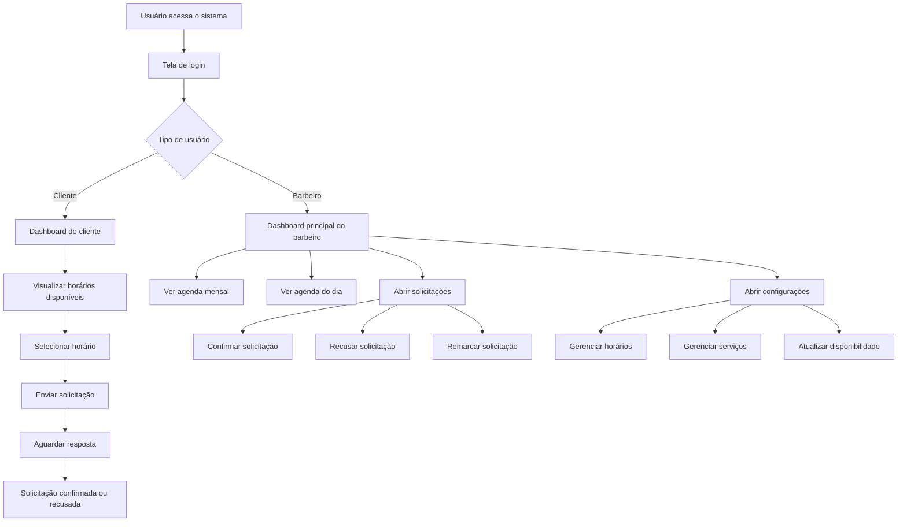

# PRD — Hora Marcada

## 1. Visão geral

O ATOM é um web app de agendamento para clientes de barbearia e barbeiros autônomos. O produto resolve a dificuldade de organizar horários, visualizar disponibilidade com clareza e reduzir a sobrecarga administrativa causada pelo gerenciamento manual via WhatsApp. O foco inicial é um MVP simples, enxuto e fácil de usar no celular, com uma experiência consistente em todas as telas.

## 2. Sobre o produto

O sistema reúne em uma única aplicação:
- uma jornada para o cliente escolher horários disponíveis e solicitar agendamento;
- uma jornada para o barbeiro visualizar agenda, aprovar ou recusar solicitações e administrar sua disponibilidade;
- uma interface com mesma identidade visual em todas as telas;
- um fluxo direto após login, levando o usuário ao dashboard principal.

O produto será desenvolvido em React com SCSS, sem Docker e sem testes na fase inicial. A base visual atual do projeto já adota tema escuro, botões de destaque em verde, estados de atenção em vermelho, cards escuros e tipografia com forte presença visual.

## 2.1 Escopo da semana — POC técnica

Para esta semana, o foco do projeto deve ser uma POC técnica, seguindo a linha do documento de validação. O objetivo não é fechar o produto final, mas provar com código que a solução pode ser construída de forma viável.

A POC desta semana deve:
- demonstrar um fluxo funcional real ou parcialmente funcional;
- usar a IA como apoio para gerar base, acelerar implementação e organizar o fluxo;
- deixar claro o que foi gerado pela IA, o que foi ajustado pelo time e o que foi efetivamente entendido;
- priorizar a funcionalidade principal do MVP;
- gerar uma evidência demonstrável, como link funcional, tela navegável ou fluxo integrado.

Nesta etapa, a entrega deve validar principalmente:
- a visualização da agenda;
- a navegação entre telas principais;
- a consistência visual do design system;
- a viabilidade técnica da estrutura React + SCSS;
- o reaproveitamento dos arquivos já existentes no projeto, especialmente `Login.jsx` e `src/styles/_mixins.scss`, sem criar novos arquivos globais de estilo nesta semana.

## 3. Propósito

O propósito do ATOM é permitir que barbeiros autônomos e pequenas barbearias tenham mais organização, praticidade e autonomia na gestão de horários, reduzindo o tempo gasto com atendimento manual e evitando conflitos de agenda.

## 4. Público-alvo

### Primário
- Barbeiros autônomos.
- Donos de pequenas barbearias.

### Secundário
- Clientes que desejam agendar serviços de forma simples e rápida.
- Usuários que preferem consultar disponibilidade sem depender de troca de mensagens.

### Persona-base
- Barbeiro autônomo, com rotina corrida, que atende sozinho e usa o celular como principal ferramenta de trabalho.

## 5. Objetivos

- Centralizar a gestão de agenda em uma interface clara.
- Reduzir o uso de mensagens manuais para marcar horários.
- Permitir que o cliente visualize horários disponíveis e solicite agendamento.
- Permitir que o barbeiro confirme, recuse ou reorganize solicitações.
- Exibir o status da agenda com leitura rápida.
- Manter o design simples, consistente e reaproveitável em todas as telas.
- Preservar uma base técnica leve e fácil de manter.

## 6. Requisitos funcionais

### 6.1 Autenticação e entrada
- O usuário deve conseguir acessar o sistema via tela de login.
- Após logar, o usuário deve ser direcionado para o dashboard principal.
- O sistema deve considerar pelo menos dois perfis: cliente e barbeiro.
- A interface deve manter textos em português brasileiro.

### 6.2 Dashboard principal
- O dashboard deve ser a tela inicial após autenticação.
- O dashboard deve apresentar atalhos para agenda, solicitações e configurações.
- O dashboard deve usar o mesmo cabeçalho em todas as telas autenticadas.
- O dashboard deve mostrar indicadores resumidos de agenda quando aplicável.

### 6.3 Agenda mensal
- O usuário barbeiro deve visualizar a agenda em formato mensal.
- Os dias devem indicar se há eventos, quantidade de compromissos ou estado relevante.
- A navegação entre meses deve ser simples.
- A leitura da agenda deve priorizar clareza visual.
- A implementação inicial da POC deve ser feita em `AgendaMensal.jsx`, reaproveitando a base visual e as variáveis já existentes em `src/styles/_mixins.scss`.

### 6.4 Agenda do dia
- O usuário barbeiro deve visualizar os agendamentos do dia em lista.
- Cada agendamento deve exibir horário, serviço, cliente e status.
- O sistema deve permitir filtro por status quando necessário.
- O layout deve favorecer leitura rápida entre atendimentos.

### 6.5 Solicitações
- O sistema deve listar solicitações pendentes e resolvidas.
- O barbeiro deve poder confirmar uma solicitação.
- O barbeiro deve poder recusar uma solicitação.
- O barbeiro deve poder remarcar uma solicitação.
- Cada solicitação deve mostrar serviço, data, horário, cliente e observações.

### 6.6 Configurações
- O barbeiro deve poder gerenciar disponibilidade.
- O barbeiro deve poder adicionar, editar e remover horários de atendimento.
- O barbeiro deve poder gerenciar serviços e seus valores.
- O layout de configuração deve seguir o mesmo padrão visual das demais telas.

### 6.7 Fluxo do cliente
- O cliente deve visualizar horários disponíveis.
- O cliente deve escolher um horário livre.
- O cliente deve enviar solicitação de agendamento.
- O cliente deve receber retorno de status da solicitação.
- O fluxo deve ser curto e sem etapas desnecessárias.

### 6.8 Componentes compartilhados
- O sistema deve reutilizar os mesmos componentes visuais entre telas.
- Header, botões, tabs, cards, badges e listas devem seguir um padrão único.
- Estados de sucesso, atenção, erro e neutro devem ser reaproveitados.

### 6.9 Flowchart Mermaid com os fluxos de UX

## 7. Requisitos não-funcionais

- O sistema deve ser responsivo e funcionar bem em mobile primeiro.
- O sistema deve carregar rapidamente e evitar complexidade desnecessária.
- O código deve ser escrito em inglês.
- Os textos visíveis na interface devem permanecer em português brasileiro.
- O projeto deve usar React com componentes funcionais.
- A organização do código pode usar classes apenas quando fizer sentido para serviços, modelos ou utilitários.
- Não usar Docker na fase inicial.
- Não implementar testes na fase inicial.
- O design deve ser consistente entre todas as telas.
- O sistema deve ser fácil de manter por um time pequeno.
- O fluxo deve priorizar simplicidade e previsibilidade.
- O app deve respeitar boas práticas de acessibilidade básicas: contraste, hierarquia visual, foco e botões legíveis.

## 8. Arquitetura técnica

### 8.1 Stack
- React
- Vite
- SCSS
- HTML5
- JavaScript

### 8.2 Princípios de implementação
- Componentes em formato de funções.
- Reutilização máxima de layout e componentes visuais.
- Separação simples entre página, componente, dados mockados e estilos.
- Evitar over engineering.
- Evitar bibliotecas de estado complexas no início.
- Introduzir camadas adicionais apenas quando houver dor real.

### 8.3 Estrutura esperada
- `src/components` para componentes reutilizáveis
- `src/styles` para SCSS global, mixins e variáveis já existentes
- `src/data` para dados mockados ou constantes de interface
- `src/App.jsx` para composição de rotas ou telas principais
- `main.jsx` para bootstrap do app
- Reutilização obrigatória dos arquivos já presentes na base, como `Login.jsx` e `src/styles/_mixins.scss`, antes de qualquer criação nova de estrutura global

## 9. Design system

### 9.1 Direção visual
- Tema escuro.
- Alto contraste entre fundo, cards e conteúdo.
- Destaques em verde para ações positivas e chamadas principais.
- Vermelho para ações destrutivas e alertas.
- Elementos com bordas arredondadas suaves.
- Cards com fundo escuro ligeiramente elevado.

### 9.2 Cores
Baseadas no design já presente no projeto:
- Fundo principal: `#0d0d0d`
- Fundo de card/surface: `#1a1a1a`
- Superfície secundária: `#262626`
- Borda sutil: `#333333` / `#404040`
- Texto principal: `#ffffff`
- Texto secundário: `#aaaaaa`
- Texto de baixa ênfase: `#999999`
- Cor primária / destaque: `#cca43b`
- Cor de sucesso: `#2ecc71`
- Cor de erro: `#ff4d4d`

### 9.3 Tipografia
- Fonte de base: `Barlow`, sans-serif
- Fonte de título/impacto: `Bebas Neue`, sans-serif
- Texto deve manter leitura clara em telas pequenas
- Títulos podem usar espaçamento e peso visual mais forte

### 9.4 Botões
- Botão primário: verde, para ação principal.
- Botão secundário: contorno discreto, para navegação.
- Botão destrutivo: vermelho.
- Botões devem ter hover e active state.
- Botões devem ter raio suave e boa área de toque.

### 9.5 Inputs e forms
- Inputs e selects com fundo escuro.
- Borda discreta e foco bem visível.
- Labels acima dos campos.
- Forms compactos, com espaçamento curto e claro.
- Campos devem seguir o mesmo padrão em todas as telas.

### 9.6 Grid e layout
- Layout em grid e flex, com uso simples.
- Coluna principal para conteúdo.
- Coluna lateral quando houver resumo, filtros ou ações rápidas.
- Espaçamento consistente entre blocos.
- Padrão mobile-first.

### 9.7 Menus e navegação
- Menu superior fixo ou persistente.
- Abas com estado ativo bem evidente.
- Badges para contagem de pendências.
- Área de usuário no canto superior direito.
- Navegação simples entre agenda, dia, solicitações e config.

## 10. User stories

### Épico 1 — Autenticação e entrada
Como usuário, quero fazer login no sistema para acessar minha área correta e começar a usar o agendamento sem atrito.

### Épico 2 — Visualização de agenda
Como barbeiro, quero visualizar minha agenda mensal e diária para entender rapidamente meus compromissos e minha disponibilidade.

### Épico 3 — Gestão de solicitações
Como barbeiro, quero ver solicitações pendentes e resolvê-las rapidamente para manter a agenda organizada.

### Épico 4 — Escolha de horário
Como cliente, quero ver horários disponíveis e escolher um deles para solicitar meu atendimento.

### Épico 5 — Configuração da operação
Como barbeiro, quero ajustar meus horários e serviços para refletir a realidade do meu atendimento.

### Critérios de aceite
- O login direciona o usuário para o dashboard principal.
- A navegação entre telas mantém o mesmo layout visual.
- A agenda mensal mostra o contexto do mês com clareza.
- A agenda do dia lista horários e status de forma legível.
- Solicitações podem ser confirmadas, recusadas e remarcadas.
- Configurações permitem atualização de horários e serviços.
- Os textos da interface permanecem em português brasileiro.
- O código-fonte permanece em inglês.
- O design se mantém consistente entre todas as telas.
- O produto não depende de Docker ou testes nesta fase inicial.

## 11. Métricas de sucesso

### KPIs de produto
- Taxa de agendamentos concluídos.
- Taxa de solicitações respondidas pelo barbeiro.
- Percentual de horários confirmados.
- Tempo médio entre solicitação e resposta.
- Redução de conflitos de horário.

### KPIs de uso
- Tempo médio para realizar um agendamento.
- Número de acessos por usuário por semana.
- Taxa de retorno dos clientes.
- Taxa de uso da agenda diária pelo barbeiro.
- Frequência de uso das telas de solicitações e configurações.

### KPIs de qualidade
- Redução de erros de visualização da agenda.
- Menor número de etapas para concluir uma ação.
- Menor taxa de abandono no fluxo de agendamento.

## 12. Riscos e mitigações

### Risco 1 — Complexidade excessiva
Mitigação: manter o MVP enxuto e evitar bibliotecas ou camadas que não sejam necessárias.

### Risco 2 — Conflito de horários
Mitigação: tratar disponibilidade como fonte única de verdade e validar horários antes de confirmar.

### Risco 3 — Inconsistência visual entre telas
Mitigação: usar um design system simples com componentes compartilhados.

### Risco 4 — Escopo crescer cedo demais
Mitigação: manter lembretes, fila manual e finanças fora do MVP inicial.

### Risco 5 — Dificuldade de uso em mobile
Mitigação: priorizar layout responsivo e ações com toque fácil.

### Risco 6 — Dívida técnica no início
Mitigação: organizar pastas, nomes e componentes desde a primeira implementação.

## 13. Lista de tarefas

### Sprint 0 — POC técnica desta semana [X]
- [X] 0.1 Definir o recorte mínimo da prova técnica
  - [X] 0.1.1 Escolher a funcionalidade principal a demonstrar
  - [X] 0.1.2 Limitar o escopo ao necessário para provar viabilidade
  - [X] 0.1.3 Registrar o que fica fora desta etapa
- [X] 0.2 Integrar a IA ao processo de construção
  - [X] 0.2.1 Usar IA para gerar base inicial de código
  - [X] 0.2.2 Revisar manualmente o código gerado
  - [X] 0.2.3 Ajustar estrutura e nomenclatura conforme o projeto
- [X] 0.3 Montar evidência técnica demonstrável
  - [X] 0.3.1 Criar link funcional ou fluxo navegável
  - [X] 0.3.2 Garantir que a navegação principal funcione
  - [X] 0.3.3 Validar a tela principal após login
- [X] 0.4 Documentar o processo da POC
  - [X] 0.4.1 Registrar o que foi gerado pela IA
  - [X] 0.4.2 Registrar o que foi ajustado pelo time
  - [X] 0.4.3 Registrar o que foi entendido tecnicamente
- [X] 0.5 Revisar foco do MVP
  - [X] 0.5.1 Confirmar que o escopo continua enxuto
  - [X] 0.5.2 Evitar implementar Docker nesta etapa
  - [X] 0.5.3 Evitar implementar testes nesta etapa
- [X] 0.6 Reaproveitar a base existente do projeto
  - [X] 0.6.1 Usar `Login.jsx` como referência para identidade visual e estrutura de integração
  - [X] 0.6.2 Usar `src/styles/_mixins.scss` como fonte das variáveis de cor e mixins já existentes
  - [X] 0.6.3 Criar `AgendaMensal.jsx` sem criar novos arquivos globais de estilo nesta semana
  - [X] 0.6.4 Importar e reutilizar as variáveis existentes em vez de duplicar tokens de design

### Sprint 1 — Base do projeto e estrutura visual [X]
- [X] 1.1 Revisar estrutura de pastas do projeto principal
  - [X] 1.1.1 Confirmar pontos de entrada do app
  - [X] 1.1.2 Separar telas integradas da pasta nos arquivos `agendaDiaDia.html`, `agendaMensal.html`, `configuracoes.html` e `solicitacoes.html`
  - [X] 1.1.3 Definir pasta base para layout compartilhado
- [X] 1.2 Consolidar identidade visual
  - [X] 1.2.1 Mapear cores já utilizadas no projeto
  - [X] 1.2.2 Confirmar tipografias existentes
  - [X] 1.2.3 Padronizar raios, sombras e espaçamentos
- [X] 1.3 Criar base de estilos SCSS
  - [X] 1.3.1 Criar variáveis globais
  - [X] 1.3.2 Criar mixins básicos
  - [X] 1.3.3 Organizar arquivo principal de estilos
- [X] 1.4 Definir layout base autenticado
  - [X] 1.4.1 Criar shell visual do app
  - [X] 1.4.2 Criar header compartilhado
  - [X] 1.4.3 Definir área de conteúdo principal

### Sprint 2 — Navegação e dashboard principal [X]
- [X] 2.1 Criar navegação superior
  - [X] 2.1.1 Adicionar abas de Agenda
  - [X] 2.1.2 Adicionar aba Dia
  - [X] 2.1.3 Adicionar aba Solicitações
  - [X] 2.1.4 Adicionar aba Config
- [X] 2.2 Implementar estado visual de ativo
  - [X] 2.2.1 Destacar aba selecionada
  - [X] 2.2.2 Aplicar badge em solicitações pendentes
  - [X] 2.2.3 Padronizar hover e foco
- [X] 2.3 Criar dashboard após login
  - [X] 2.3.1 Direcionar usuário autenticado para a tela principal
  - [X] 2.3.2 Exibir resumo inicial
  - [X] 2.3.3 Manter layout consistente com as demais telas

### Sprint 3 — Agenda mensal [X]
- [X] 3.1 Criar componente de calendário mensal
  - [X] 3.1.1 Cabeçalho do mês
  - [X] 3.1.2 Grade semanal
  - [X] 3.1.3 Células com estado visual
- [X] 3.2 Exibir eventos por dia
  - [X] 3.2.1 Renderizar horários ocupados
  - [X] 3.2.2 Renderizar contagem de itens extras
  - [X] 3.2.3 Indicar dias com maior volume
- [X] 3.3 Criar resumo lateral [X]
  - [X] 3.3.1 Total de agendamentos
  - [X] 3.3.2 Confirmados
  - [X] 3.3.3 Pendentes
  - [X] 3.3.4 Cancelados
  - [X] 3.3.5 Receita estimada
- [X] 3.4 Criar CTA de novo agendamento [X]
  - [X] 3.4.1 Botão principal
  - [X] 3.4.2 Botão de visualização diária

### Sprint 4 — Agenda do dia [X]
- [X] 4.1 Criar lista diária de agendamentos
  - [X] 4.1.1 Linha de horário
  - [X] 4.1.2 Nome do serviço
  - [X] 4.1.3 Nome do cliente
  - [X] 4.1.4 Badge de status
- [X] 4.2 Implementar filtro por status
  - [X] 4.2.1 Aba Todos
  - [X] 4.2.2 Aba Confirmados
  - [X] 4.2.3 Aba Pendentes
- [X] 4.3 Separar estados visuais
  - [X] 4.3.1 Confirmado
  - [X] 4.3.2 Pendente
  - [X] 4.3.3 Cancelado
- [X] 4.4 Adicionar ações de criação
  - [X] 4.4.1 Botão de novo agendamento
  - [X] 4.4.2 Abertura de formulário simples

### Sprint 5 — Solicitações [X]
- [X] 5.1 Criar tela de solicitações
  - [X] 5.1.1 Cabeçalho da seção
  - [X] 5.1.2 Contagem de pendentes e total
  - [X] 5.1.3 Filtro de status
- [X] 5.2 Criar card de solicitação
  - [X] 5.2.1 Serviço
  - [X] 5.2.2 Data e horário
  - [X] 5.2.3 Cliente
  - [X] 5.2.4 Observação
- [X] 5.3 Criar ações do barbeiro
  - [X] 5.3.1 Confirmar solicitação
  - [X] 5.3.2 Recusar solicitação
  - [X] 5.3.3 Remarcar solicitação
- [X] 5.4 Padronizar feedback visual
  - [X] 5.4.1 Sucesso
  - [X] 5.4.2 Erro
  - [X] 5.4.3 Atenção

### Sprint 6 — Configurações [X]
- [X] 6.1 Criar tela de horários
  - [X] 6.1.1 Lista de blocos de horário
  - [X] 6.1.2 Ação de editar
  - [X] 6.1.3 Ação de remover
- [X] 6.2 Criar seção de serviços
  - [X] 6.2.1 Lista de serviços
  - [X] 6.2.2 Duração do serviço
  - [X] 6.2.3 Preço do serviço
  - [X] 6.2.4 Ação de adicionar serviço
- [X] 6.3 Padronizar formulários
  - [X] 6.3.1 Inputs
  - [X] 6.3.2 Selects
  - [X] 6.3.3 Botões de ação
- [X] 6.4 Organizar dados mockados
  - [X] 6.4.1 Horários
  - [X] 6.4.2 Serviços
  - [X] 6.4.3 Solicitações

### Sprint 7 — Integração e acabamento
- [X] 7.1 Reaproveitar componentes comuns
  - [X] 7.1.1 Evitar duplicação de header
  - [X] 7.1.2 Ajustar imports e nomes
- [X] 7.2 Garantir consistência de conteúdo
  - [X] 7.2.1 Manter código em inglês
  - [X] 7.2.2 Manter textos da UI em português
  - [X] 7.2.3 Revisar microcopy
- [ ] 7.3 Ajustar responsividade
  - [ ] 7.3.1 Mobile
  - [ ] 7.3.2 Tablet
  - [ ] 7.3.3 Desktop
- [ ] 7.4 Criar componente menu hambúrguer na versão mobile
  - [ ] 7.4.1 Com menu aberto, acrescentar desfoque no fundo para impedir interação com o conteúdo que não está visível
  - [ ] 7.4.2 Botões do cabeçalho devem ficar no menu hambúrguer
- [ ] 7.5 Revisão final de usabilidade
  - [ ] 7.5.1 Leitura da agenda
  - [ ] 7.5.2 Clareza de status
  - [ ] 7.5.3 Acesso rápido às principais ações

### Sprint 8 — Itens deixados para fases finais
- [ ] 8.1 Docker
  - [ ] 8.1.1 Avaliar necessidade
  - [ ] 8.1.2 Criar containerização apenas quando houver valor real
- [ ] 8.2 Testes
  - [ ] 8.2.1 Definir escopo de testes unitários
  - [ ] 8.2.2 Definir testes de integração
  - [ ] 8.2.3 Implantar somente quando a base estiver estável

## 14. Observações finais

O MVP deve permanecer focado na dor principal: organizar agendamentos e tornar a agenda fácil de entender. Funcionalidades como finanças, fiado, fila manual e automações avançadas devem ficar para futuras iterações.

Nesta semana, a entrega deve ser tratada como POC técnica: uma prova real de que a solução pode funcionar, com evidência demonstrável e sem ampliar o escopo além do necessário.

A implementação desta semana deve respeitar a base já existente no projeto, reaproveitando `Login.jsx` e `src/styles/_mixins.scss`, sem introduzir novos arquivos globais de estilo.